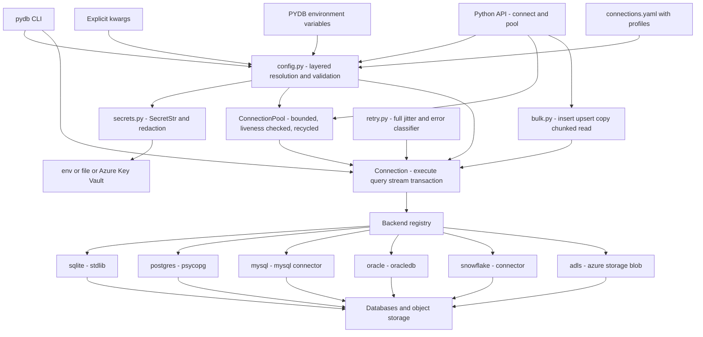

# pydb-connect

**Config-driven database and object-store connectivity.** One interface, many
backends. Credentials come from the environment or a secret store, connections
close on every path, bulk loads batch instead of looping, and retries know the
difference between a dropped TCP session and a typo in your SQL.

```python
from pydbconnect import connect, bulk_insert

with connect("warehouse") as conn:              # config resolved, secret fetched
    bulk_insert(conn, "fact_sales", rows, chunk_size=5000)
```

No pydantic, no SQLAlchemy, no pandas. Standard library plus optional PyYAML.
Python 3.9+.

---

## The code this replaces

Every data team writes this. It is in production somewhere near you right now.

```python
# config.properties
# db.host=prod-db.internal
# db.user=etl_writer
# db.password=Wint3r2024!          <-- in version control, forever
```

```python
import configparser, mysql.connector

cfg = configparser.ConfigParser()
cfg.read("config.properties")

conn = None
for attempt in range(10):                                        # (4)
    try:
        conn = mysql.connector.connect(
            host=cfg["db"]["host"],
            user=cfg["db"]["user"],
            password=cfg["db"]["password"],                       # (1)
        )
        cur = conn.cursor()
        for row in rows:                                          # (3)
            cur.execute("INSERT INTO sales VALUES (%s, %s)", row)
            conn.commit()
        break
    except Exception as e:                                        # (4)
        print(f"failed: {e}")
        time.sleep(5)
    finally:
        conn.close()                                              # (2)
```

Four separate defects, and all four are routine:

**(1) The credential is in the repository.** Deleting the line later does
nothing: git keeps it, in every clone, every fork, every CI cache, every laptop
backup. Rotating means finding every consumer, and nobody has that list -
that's why it went in the file to begin with. The blast radius is not the repo;
it is every schema that account can read.
→ `pydb-connect` puts a *reference* in config (`secret: env:PGPASSWORD`) and
resolves it at connect time. The value lives in a `SecretStr` that renders as
`***` in `str`, `repr`, f-strings and log records.

**(2) The connection leaks.** `conn.close()` raises `AttributeError` on `None`
when the *connect itself* failed - replacing the real error with a bogus one,
inside `finally`, where it also swallows the original. And here it runs on
every loop iteration, closing the connection the next attempt needs. Remove the
`finally` and you leak instead: the pool fills, and a week later something
unrelated gets `too many connections`.
→ `Connection.__exit__` always closes, closes cursors in `finally`, rolls back
uncommitted work first, and is idempotent. `close()` never raises.

**(3) `execute()` in a loop, with a commit per row.** Each iteration is a full
network round trip; each commit is an fsync. At a 2ms round trip, a million
rows takes over half an hour of pure latency. The fix is not a faster loop - it
is to stop making one round trip per row.
→ `bulk_insert` batches into `executemany`, one call per chunk.
`examples/02_bulk_load.py` measures it: two to three orders of magnitude more
throughput than the commit-per-row loop, on a local file where there is no
network latency to save at all.

**(4) `except Exception` with a fixed sleep.** This retries a syntax error ten
times. It retries a unique-key violation ten times. It retries a missing column
ten times, and each attempt is guaranteed to fail identically. Meanwhile the
fixed sleep means every worker retries in lockstep, so a database that wobbled
now gets a synchronised retry storm that finishes what the wobble started.
→ `retry.py` classifies by driver error code first: SQLSTATE `40001` is a
serialisation failure and gets retried, `23505` is a duplicate key and does not.
Backoff is exponential with **full jitter**, capped by both attempt count and
wall-clock time.

---

## Install

```bash
pip install pydb-connect                       # core, no drivers
pip install "pydb-connect[postgres]"           # + psycopg
pip install "pydb-connect[mysql]"              # + mysql-connector-python
pip install "pydb-connect[oracle]"             # + oracledb
pip install "pydb-connect[snowflake]"          # + snowflake-connector-python
pip install "pydb-connect[azure]"              # + azure-storage-blob, azure-identity
pip install "pydb-connect[all]"                # everything
```

The core install has **no dependencies**. Every driver import is lazy, so the
library imports and its whole test suite passes with no database driver
installed at all - and there is a test asserting exactly that. A broken Oracle
client cannot stop a Postgres job from starting.

`sqlite` works out of the box: it is the standard library.

---

## 60-second quickstart

No database, no credentials, no container.

```bash
mkdir demo && cd demo
cat > connections.yaml <<'YAML'
connections:
  local:
    backend: sqlite
    database: ./demo.db
YAML
```

```python
# quickstart.py
from pydbconnect import connect, bulk_insert, chunked_read

REGIONS = ("EMEA", "AMER", "APAC")

with connect("local") as conn:                    # reads ./connections.yaml
    conn.execute("DROP TABLE IF EXISTS orders")
    conn.execute(
        "CREATE TABLE orders ("
        " id INTEGER PRIMARY KEY, customer TEXT, region TEXT, amount REAL)"
    )

    # 50,000 rows in batches, not one INSERT at a time.
    rows = (
        {"id": i,
         "customer": f"customer-{i % 500:03d}",
         "region": REGIONS[i % 3],
         "amount": round((i * 37) % 9973 / 100, 2)}
        for i in range(1, 50_001)
    )
    print(bulk_insert(conn, "orders", rows, chunk_size=5_000).summary())

    # Parameterised query. Rows come back as dicts.
    for row in conn.query(
        "SELECT region, count(*) AS orders, round(sum(amount), 2) AS total"
        "  FROM orders WHERE amount > ? GROUP BY region ORDER BY region",
        (10.0,),
    ):
        print(row)

    # Stream a big result without loading it into memory.
    batches = sum(1 for _ in chunked_read(conn, "SELECT * FROM orders", chunk_size=10_000))
    print(f"streamed {batches} batches of at most 10,000 rows")
```

```console
$ python quickstart.py
50,000 row(s) into orders in 10 chunk(s), 0.33s, 152,271 rows/s [executemany]
{'region': 'AMER', 'orders': 14989, 'total': 821496.88}
{'region': 'APAC', 'orders': 14989, 'total': 821480.41}
{'region': 'EMEA', 'orders': 14990, 'total': 821523.35}
streamed 5 batches of at most 10,000 rows
```

That is real output from that script. Note what did not happen: no connection
string in the code, no cursor management, no `finally`, no memory spike on
50,000 rows, and the connection is closed whether the block succeeded or threw.

To point the same code at PostgreSQL, change the config. Not the code.

```yaml
connections:
  local:
    backend: postgres
    host: db.internal
    database: analytics
    user: etl_writer
    secret: env:PGPASSWORD
```

---

## Configuration

Four layers, highest wins: **explicit kwargs → environment → YAML file →
defaults**. Nothing in the chain contains a password.

```yaml
version: 1
default_profile: dev

defaults:                        # merged under every connection
  pool: {max_size: 5, timeout: 30, pre_ping: true, recycle: 1800}
  retry: {max_attempts: 3, initial_backoff: 0.2, max_elapsed: 60, jitter: full}

connections:                     # visible in every profile
  local:
    backend: sqlite
    database: ./local.db

profiles:
  dev:
    connections:
      warehouse: {backend: sqlite, database: ./dev.db}

  prod:
    defaults:
      pool: {max_size: 20}
    connections:
      warehouse:
        backend: postgres
        host: ${env:PGHOST}          # placeholders resolved at load time
        port: 5432
        database: analytics
        schema: reporting
        user: etl_writer
        secret: env:PGPASSWORD       # a reference, never a value
        sql_guard: error             # refuse string-interpolated SQL outright
        options:
          sslmode: require
          application_name: nightly-load
```

Override anything from the environment, which is how containers and CI should
do it:

```bash
export PYDB_WAREHOUSE_HOST=db-replica.internal
export PYDB_WAREHOUSE_POOL_MAX_SIZE=12
export PYDB_WAREHOUSE_PASSWORD="$(cat /run/secrets/db)"   # becomes a reference
```

A connection can be defined with **no file at all** - useful for an image that
should carry no environment-specific data. Full reference:
[docs/configuration.md](docs/configuration.md).

---

## Architecture



A backend owns the five things that genuinely differ between databases -
connecting, placeholder style, identifier quoting, upsert syntax, error
classification. Everything else is written once and shared, which is why a new
backend is about 150 lines.

---

## Features

| Feature | What you get | Why it matters |
|---------|--------------|----------------|
| **Layered config** | kwargs → env → YAML → defaults, with profiles | One file for dev, test and prod; per-machine values stay out of git |
| **Secret references** | `env:` `file:` `keyvault:` `literal:`, pluggable | The repo holds a name, not a password |
| **`SecretStr`** | `***` in `str`, `repr`, f-strings, logs; `.reveal()` only | A credential cannot leak through a print or a stack trace |
| **Redaction** | Auto-scrub in errors, `repr`, and a `logging` filter | Catches the driver that puts the DSN in its error text |
| **Always closes** | `__exit__`, cursors in `finally`, idempotent `close()` | The leak in the anti-pattern above cannot happen |
| **Bounded pool** | Checkout timeout, liveness on borrow, recycle, thread-safe | A slow query cannot exhaust connections for everyone else |
| **Transactions** | `with conn.transaction():`, commit or rollback as a unit | Nested blocks join the outer one; no fake savepoints |
| **`executemany` bulk** | Chunked, progress callback, resumable error | 176x a per-row loop locally; far more over a network |
| **Native `COPY`** | Postgres `COPY`, Snowflake `PUT`+`COPY INTO`, MySQL `LOAD DATA` | Falls back honestly and says so in `BulkResult.method` |
| **Dialect-aware upsert** | `ON CONFLICT` / `ON DUPLICATE KEY` / `MERGE` | Portable idempotent loads without writing five statements |
| **Chunked read** | `chunked_read` and `stream` in bounded memory | 10.5x less peak memory on 100k rows, measured |
| **Smart retry** | Error codes first, full jitter, attempt *and* time limits | A syntax error is never retried; a deadlock always is |
| **Object storage** | ADLS Gen2 / Blob with managed identity | Lake and warehouse configured the same way, in one file |
| **SQL guard** | Warns or errors on string-interpolated SQL | Catches injection risk at the call site |
| **CLI** | `ping`, `query`, `load`, `config validate/list` | Gate a deploy on config validity; debug without writing a script |
| **No dependencies** | Standard library, optional PyYAML | Nothing to conflict with your stack |

---

## Backend support

| Backend | Driver | Extra | Bulk copy | Upsert | Streaming | Transactions | Params |
|---------|--------|-------|-----------|--------|-----------|--------------|--------|
| `sqlite` | `sqlite3` (stdlib) | none | no | yes | yes | yes | `?` |
| `postgres` | `psycopg` / `psycopg2` | `postgres` | `COPY FROM STDIN` | yes | server-side cursor | yes | `%s` |
| `mysql` | `mysql-connector-python` | `mysql` | `LOAD DATA LOCAL INFILE` | yes | unbuffered cursor | yes | `%s` |
| `oracle` | `python-oracledb` | `oracle` | array DML via `executemany` | yes | prefetch tuned | yes | `:1` |
| `snowflake` | `snowflake-connector-python` | `snowflake` | `PUT` + `COPY INTO` | yes | yes | yes | `%s` |
| `adls` | `azure-storage-blob` | `azure` | n/a | no | n/a | no | n/a |

Aliases: `postgresql`, `mariadb`, `azure_blob`.

`adls` is object storage, so only part of the interface applies - `execute` and
`query` raise `NotSupportedError` pointing at `connection.client`, which
exposes `list_paths`, `read_bytes`, `write_bytes`, `upload_file` and friends.
With no `secret` configured it authenticates with `DefaultAzureCredential`, so
there is nothing to store and nothing to rotate.

See [docs/backends.md](docs/backends.md) for per-backend configuration, the
upsert SQL each one generates, error-code classification tables, and a
step-by-step guide to adding your own.

---

## CLI

```console
$ pydb config list
config: connections.yaml   profile: (none)

name  | backend | host | database  | schema | user | secret
------+---------+------+-----------+--------+------+-------
local | sqlite  |      | ./demo.db |        |      |
(1 row)

$ pydb ping local
ok   local -> sqlite://./demo.db

$ pydb query local --sql "SELECT region, count(*) AS orders FROM orders GROUP BY region ORDER BY region"
region | orders
-------+-------
AMER   | 16667
APAC   | 16667
EMEA   | 16666
(3 rows)

$ pydb query local --sql "SELECT id, customer, amount FROM orders WHERE region = ? ORDER BY id" -p EMEA --limit 3
id | customer     | amount
---+--------------+-------
3  | customer-003 | 1.11
6  | customer-006 | 2.22
9  | customer-009 | 3.33
(3 rows)

$ pydb load local --table orders --file new_orders.csv --chunk 5000
  ... 3 row(s)
3 row(s) into orders in 1 chunk(s), 0.01s, 283 rows/s [executemany]

$ pydb config validate
ok   local -> sqlite ./demo.db

1/1 valid in connections.yaml
```

Also: `--format json|csv`, `--profile prod`, `--config PATH`,
`--upsert-key id`, `config list --backends` to see which drivers this machine
actually has.

Exit codes are chosen so a shell script can branch on them:

| Code | Meaning |
|------|---------|
| `0` | Success |
| `1` | Operational failure - database refused, load broke, network went away. Retrying might work |
| `2` | Configuration error - missing key, unknown backend, unresolvable secret. Retrying will not |
| `130` | Interrupted |

```console
$ pydb ping nope
error: no connection named 'nope' in connections.yaml; defined connections: local. Set PYDB_NOPE_BACKEND to configure it from the environment instead (connection='nope')
$ echo $?
2
```

Which makes config validation a deployment gate:

```yaml
- run: pydb config validate --profile prod    # exits 2 if anything is wrong
```

---

## Security notes

**Credentials never enter the repository.** Config holds `secret:
env:PGPASSWORD`, a reference. The `password:` key does not exist and using it
raises a `ConfigurationError` telling you what to do instead.

**Credentials never render.** `SecretStr` produces `***` from `str()`,
`repr()`, f-strings, `%`-formatting and `.format()`. It refuses to pickle and
hashes to a constant, so it cannot be recovered from a heap dump. `.reveal()`
is the only way out, and it is trivial to grep for in review.

**Redaction is the airbag, not the brakes.** Every `SecretStr` registers its
value; `redact()` scrubs it from arbitrary text and runs automatically in
`PyDBError.__str__`, in `ConnectionConfig.__repr__` and `.to_dict()`, and in
`RedactingFilter`. Attach that filter to your logging *handlers* so records from
`psycopg`, `snowflake.connector` and `azure.core` are scrubbed too:

```python
handler.addFilter(RedactingFilter())      # handler, not logger
```

**Parameters, never string formatting.** Every method takes `sql` and `params`
separately. The SQL guard flags a quoted literal sitting where a bind parameter
belongs, or a leftover `{}`:

```python
conn.query("SELECT * FROM orders WHERE id = ?", (order_id,))    # correct
conn.query(f"SELECT * FROM orders WHERE id = {order_id}")       # flagged
```

Default is `warn`; set `sql_guard: error` in production to make it fatal. The
heuristic is deliberately narrow - it skips DDL and anything with parameters -
because a guard that cries wolf gets switched off.

**Prefer identity to secrets.** With `keyvault:` references plus managed
identity, or `adls` with `DefaultAzureCredential`, the credential count drops to
zero: the platform vouches for the workload and there is nothing to rotate.

**Retrying is bounded.** Unknown errors are classified as *not* retryable by
default. Retrying something you do not understand, against a database other
people share, is how a small incident becomes a large one.

Threat model, resolver comparison, rotation checklist, CI patterns and a
pre-merge checklist: [docs/secrets.md](docs/secrets.md).

---

## Examples

All four run against SQLite with zero setup:

```bash
python examples/01_basic_crud.py          # connect, CRUD, transactions, error handling
python examples/02_bulk_load.py           # the loop vs executemany, measured
python examples/03_chunked_read.py        # memory measured with tracemalloc
python examples/04_multi_backend_copy.py  # chunked read from one, bulk load into another
```

Real output from one run of `02_bulk_load.py`, showing the cost of the
anti-pattern. The absolute numbers depend on your disk - fsync latency is what
dominates step 1a - but the ordering never changes:

```console
=== 1a. The anti-pattern: execute() + commit() per row ========
  500 rows, one execute() and one commit() each
   0.377s  ->        1,327 rows/s
  every row pays a round trip and an fsync

=== 1b. Better: the same loop inside one transaction ==========
  2,000 rows, one execute() each, a single commit
   0.009s  ->      219,678 rows/s
  166x the throughput of 1a: one fsync for the batch instead of one per row

=== 2. bulk_insert: chunked executemany =======================
  20,000 row(s) into orders in 4 chunk(s), 0.09s, 233,792 rows/s [executemany]
         176x faster than 1a
```

And from `03_chunked_read.py`, on 100,000 rows:

```console
=== 2. query() - the whole result set in memory at once =======
  rows in memory : 100,000
  peak memory    :   49.7 MB

=== 3. chunked_read() - one batch at a time ===================
  batches        : 20
  largest batch  : 5,000 rows
  peak memory    :    4.7 MB
  reduction      : 10.5x less memory
  same answer    : 4,999,911.22 == 4,999,911.22 -> True
```

`04_multi_backend_copy.py` streams from one connection and bulk-loads into
another. Both ends are SQLite *only so it runs with no setup* - the code is
backend-agnostic, and the source could be Oracle and the target Snowflake
without a line changing.

---

## Testing

```bash
pip install -r requirements-dev.txt
python -m pytest tests/ -q
```

```console
$ python -m pytest tests/ -q
........................................................................ [ 41%]
........................................................................ [ 83%]
............................                                             [100%]
172 passed in 0.58s
```

**172 tests, no database drivers installed, no network, under a second.** That
is not a coincidence, it is the design: SQLite and in-process fakes give real
SQL semantics without a server, and both the sleep function and the clock in
the retry layer are injectable, so a policy with a 60-second cap is exercised
in microseconds.

Two tests exist purely to defend the constraint: one asserts that importing
`pydbconnect` imports **no** driver module, and one asserts that a missing
driver produces an error naming the pip extra. If someone moves `import
psycopg` to the top of a backend module, the suite fails immediately rather
than three months later on a machine that happens not to have it.

```bash
python -m pytest tests/ -q --cov=pydbconnect --cov-report=term-missing
python -m pytest tests/test_retry.py -v
ruff check pydbconnect/
mypy pydbconnect/
```

---

## Contributing

Issues and pull requests welcome at
[github.com/aniketdwivedi7388/pydb-connect](https://github.com/aniketdwivedi7388/pydb-connect).

```bash
git clone https://github.com/aniketdwivedi7388/pydb-connect
cd pydb-connect
pip install -e ".[dev]"
python -m pytest tests/ -q
```

Before opening a PR:

- `python -m pytest tests/ -q` passes **with no database drivers installed**.
- `ruff check pydbconnect/` and `mypy pydbconnect/` are clean.
- New public functions have type hints and a docstring saying what it does, what
  it raises, and why it exists.
- No driver is imported at module level - use `self.import_driver()`.
- No credential can reach a log line, a `repr` or an exception message.
- Behaviour changes come with a test that fails without the change.

Adding a backend is about 150 lines and there is a complete worked example
(DuckDB) at the end of [docs/backends.md](docs/backends.md).

---

## License

MIT. See [LICENSE](LICENSE).

Copyright (c) 2026 Aniket Dwivedi.

Built by [Aniket Dwivedi](https://github.com/aniketdwivedi7388) - data engineer
and architect. Databricks Certified Data Engineer Professional, SnowPro Core,
Azure.
